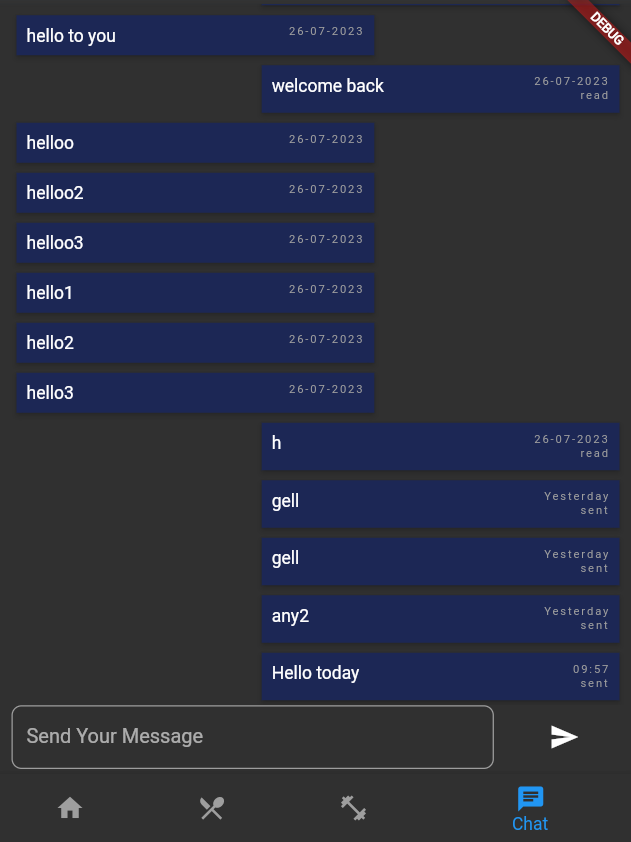
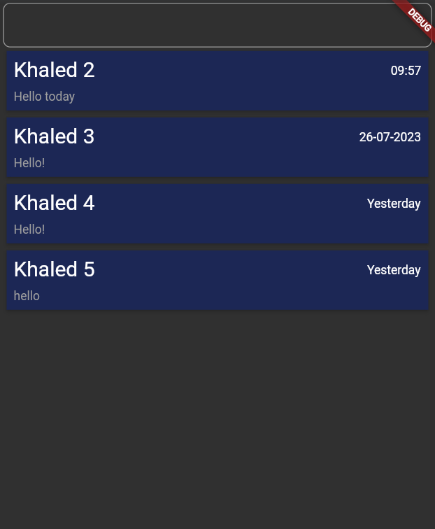

# Flutter Clean Architecture Examples

## First Example: Loading

When launching the app we check for a token saved locally so that we could log in the user without having him to submit his credentials again.
Please note that the entities and models won't be included here just to save some space. But the app needs objects for:
 - Users
 - Messages
 - Chats

### 1. Data Layer:

#### DataSources:

##### Local Source:

This is used to get the locally saved token, and also to get the info of user saved locally.

``` dart
abstract class UserLocalSource{
  Future<String?> getUserToken();
  Future<User?> getUser();
}

class UserLocalSourceImp implements UserLocalSource{
  @override
  Future<String?> getUserToken() async{
    SharedPreferences prefs = await SharedPreferences.getInstance();
    if(!prefs.containsKey('user')) return null; // no user is saved locally
    return Map.from(jsonDecode(prefs.getString('user')!))['auth'];
  }

  @override
  Future<User?> getUser() async{
    SharedPreferences prefs = await SharedPreferences.getInstance();
    if(!prefs.containsKey('user')) return null; // no user is saved locally
    Map<String, dynamic> localUserData = Map.from(jsonDecode(prefs.getString('user')!));
    User user = jsonToUser(localUserData);
    user.setAuthToken(localUserData["auth"]);
    user.setFirebaseId(localUserData["firebaseId"]);
    return user;
  }
}
```

##### Remote Source:

After getting the token we need to check if it's still valid and get the user's remote info.

``` dart
abstract class CheckUserToken{
  Future<User?> getUser(String token);
}

class CheckUserTokenImp implements CheckUserToken{
  final _connect = GetConnect();

  @override
  Future<User?> getUser(String token) async{
    final result = await _connect.get(ApiEndpoints.checkTokenValidation(token));
    if(result.statusCode != 200) return null;
    Map<String, dynamic> userInJson = result.body["user"];
    User user = jsonToUser(userInJson);
    user.setAuthToken(result.body["token"]);
    return user;
  }
}
```

#### Repositories

Implement the signin method for the abstract repository that will be defined in the domain layer.
Here we check for a token saved locally. If it is not found, that means the user isn't logged in.
Otherwise, we try validating the token and getting user info if there is a Network connection. If not, we get the info saved locally

``` dart
class SigninUserRepositoryImp implements SigninUserRepository{
  final CheckUserToken checkUserToken;
  final UserLocalSource localUser;

  SigninUserRepositoryImp({required this.checkUserToken, required this.localUser});

  @override
  Future<User> signin() async{
    String? token = await localUser.getUserToken();
    if(token == null) throw CacheException();
    if(!(await NetworkInfo.isConnected())) return (await localUser.getUser())!; // there is no connection so return the user saved locally
    final userFromServer = await checkUserToken.getUser(token);
    if(userFromServer == null) throw DataFormException();
    return userFromServer;
  }
}
```


### 2. Domain Layer:

#### Repositories:

Which defines the contract that the data layer should implement

``` dart
abstract class SigninUserRepository{
  Future<User> signin();
}
```

#### UseCases:

Here the only usecase is trying to signin the user. We return failures if we couldn't find the token or if it is not validated.

``` dart
class SigninCase implements UseCase<User, NoParams>{
  final SigninUserRepository signinUserRepository;

  SigninCase({required this.signinUserRepository});

  @override
  Future<Either<Failure, User>> trigger(NoParams params) async{
    try{
      User user = await signinUserRepository.signin();
      return Right(user);
    } on CacheException{
      return Left(CacheFailure());
    } on DataFormException{
      return Left(DataFormFailure(message: 'Token not valid'));
    }
  }
}
```

### 3. Presentation Layer:

The controller calls the singin usecase and if succesful goes to home page, otherwise, it redirects to the login page.

``` dart
class LoadingController extends GetxController{
  final SigninCase signinCase;
  final UserController userController = sl<UserController>();

  LoadingController({required this.signinCase});

  Future loadUser() async{
    Either<Failure, User> result = await signinCase.trigger(NoParams());
    result.fold(
      (failure)  {
        Get.offAndToNamed(RouteNames.login);
      },
      (user) {
        userController.user.value = user;
        Get.offAndToNamed(RouteNames.home);
      }
    );
  }
}
```


## Second Example: Messages

In this example, we will highlight the seperation of concerns as we'll only show the presentation layer, the usecases, and the abstraction of repositories.

#### Repositories: 

``` dart
abstract class MessageRepository{
  Future<Message> sendMessage(MessageModel message, String chatId);
  Future<List<MessageModel>> getMessages(String chatId);
  Future<List<MessageModel>> getUnreadMessages(String chatId, String userId);
  Stream getSentMessage(String chatId);
  Stream getMessageUpdatedInfo(String chatId, String messageId);
  Future<bool> makeMessageRead(String chatId, String messageId);
  Future<bool> saveMessagesLocally(String chatId, List<MessageModel> messages);
}
```

This shows all the data we need to read and write. We want to:
  - get chat messages
  - get chat unread messages (in case we already read the messages)
  - send a message
  - read messages that were sent by the other user
  - save the chat messages locally (in order to read them when there is no connection)


#### Usecases:

Here are some of the usecases used:

##### 1. Reading Messages:

```dart 
abstract class ReadMessageCase{
  Future<Either<Failure, List<MessageModel>>> trigger(String chatId);
}

class ReadMessageCaseImp implements ReadMessageCase{
  final MessageRepository messageRepository;

  ReadMessageCaseImp({required this.messageRepository});

  @override
  Future<Either<Failure, List<MessageModel>>> trigger(String chatId) async{
    try{
      final result = await messageRepository.getMessages(chatId);
      return Right(result);
    } on ServerException{
      return Left(ServerFailure());
    } on CacheException{
      return Left(CacheFailure());
    }
  }

}
```

The server exception indicates that messages couldn't be gotten from the external source, and cache exception indicates that we could't
fetch the messages locally (no messages are saved locally)


##### 2. Sending a Message:

``` dart
abstract class SendMessageCase{
  Future<Either<Failure, Message>> sendMessage(String message, String chatId, User user);
}

class SendMessageCaseImp implements SendMessageCase{
  final MessageRepository messageRepository;

  SendMessageCaseImp({required this.messageRepository});

  @override
  Future<Either<Failure, Message>> sendMessage(String message, String chatId, User user) async{
    try{
      MessageModel messageToSent = MessageModel.toSend(message, user);
      await messageRepository.sendMessage(messageToSent, chatId);
      return Right(messageToSent);
    } on ServerException{
      return Left(ServerFailure());
    }
  }

}
```

The only exception here is the server exception where the external source couldn't save the message

We also have other usecases to read unread messages and getting a stream of the messages (real time update)


#### Presentation:

Also not all usecases will be used here, lets take an example for when reading the messages of a chat:

``` dart
loadChatMessages() async{
    if(chat.value!.isMessagesLoaded){ // messages were already loaded before so now only get unread new ones
      final result = await unReadMessageCase.trigger(chat.value!.id, userController.user.value.getFireUserId());
      loading.value = false;
      result.fold(
        (failure)  {},
        (gottenMessages) {
          chat.value!.messages.addAll(gottenMessages);
          messagesToSaveLocally.addAll(gottenMessages);
          makeReadMessageCase.trigger(chat.value!.id, gottenMessages);
        });
      return;
    }

    // first time reading messages of this chat
    chat.value!.isMessagesLoaded = true;
    final result = await readMessageCase.trigger(chat.value!.id);
    result.fold(
      (failure)  {},
      (gottenMessages) {
        chat.value!.messages = gottenMessages;
        messagesToSaveLocally.addAll(gottenMessages);
        List<MessageModel> unreadMessages = gottenMessages.where((message) => !message.isMessageFromUser(userController.user.value) && !message.isRead).toList();
        if(unreadMessages.isNotEmpty) makeReadMessageCase.trigger(chat.value!.id, unreadMessages);
      });
    
    loading.value = false;
  }
```

When we enter a chat for the first time, we need to read all the messages, so we call the read messages usecase.
Otherwise, we only need to read the new messages sent by a user so we call the unReadMessagesCase. Finally, we read the unread messages by calling the makeReadMessagesCase.




In this page, we use all usecases mentioned previously. First, reading messages, then listening to a stream for new messages. Also, we listen to stram in case a sent message is read. Also, calling a usecase to send messages. Finally, we save messages when we exit this page.




Here, we can search for users, and call a create chat usecase. Also, we are always updated with the latest messages by listening to stream usecase.


Now lets check the [clean architecture in Asp.net](asp-clean-architecture.md)